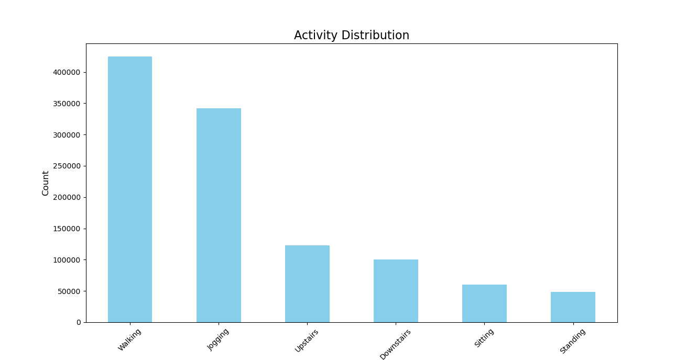
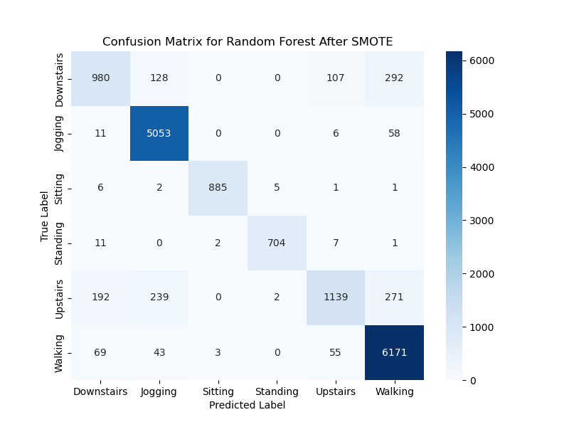
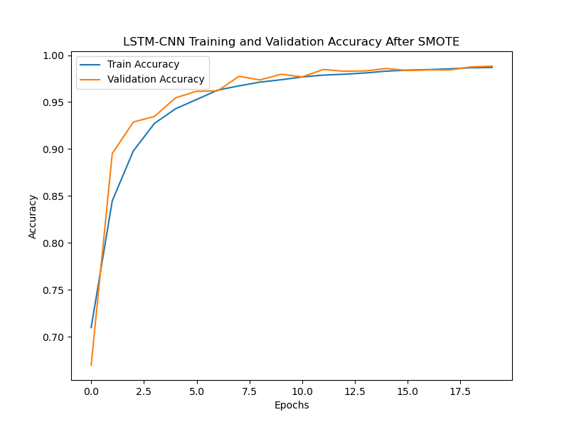
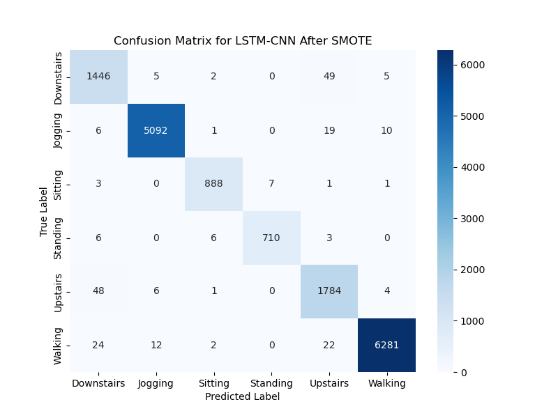
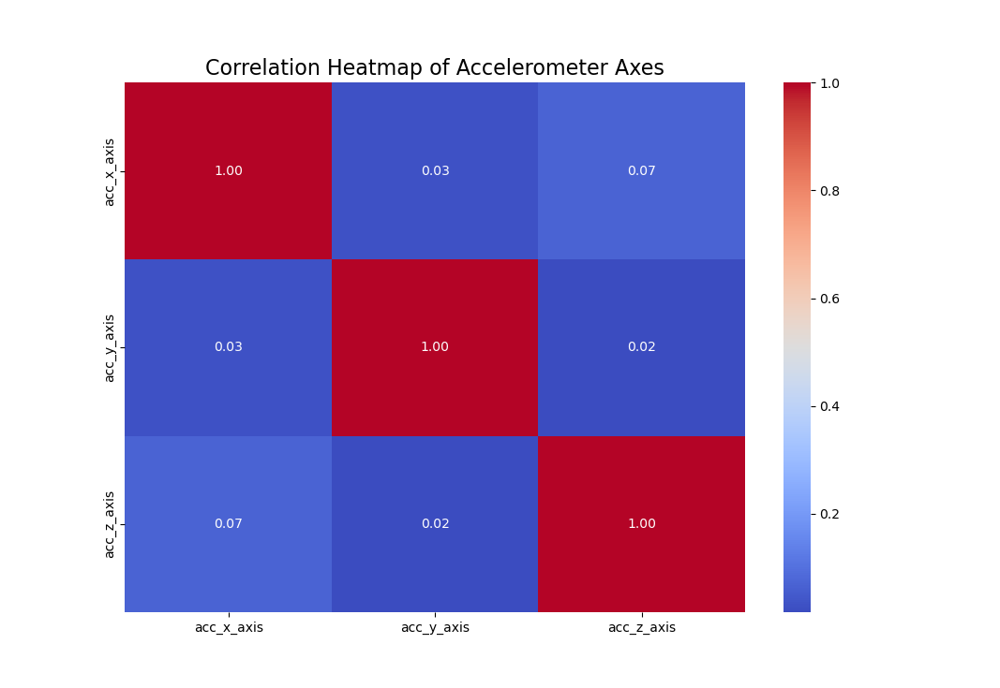
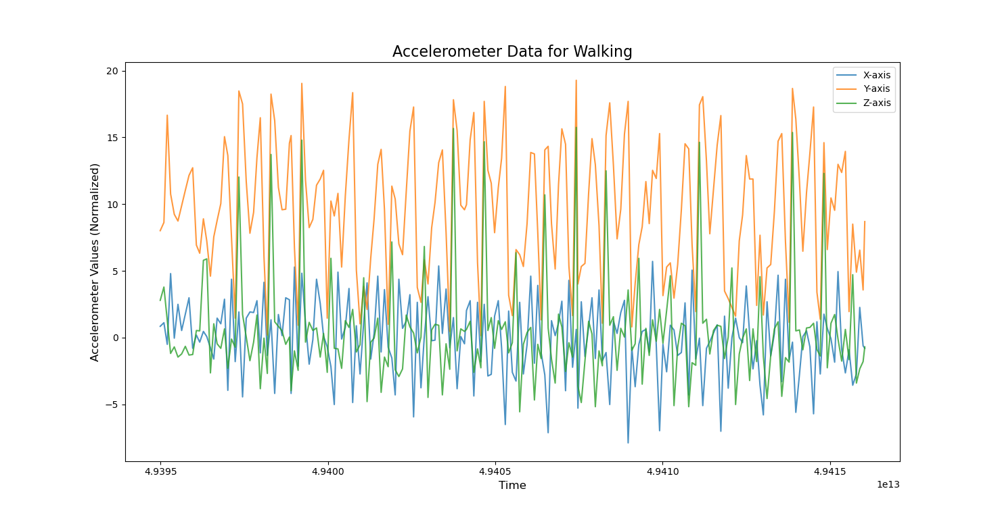
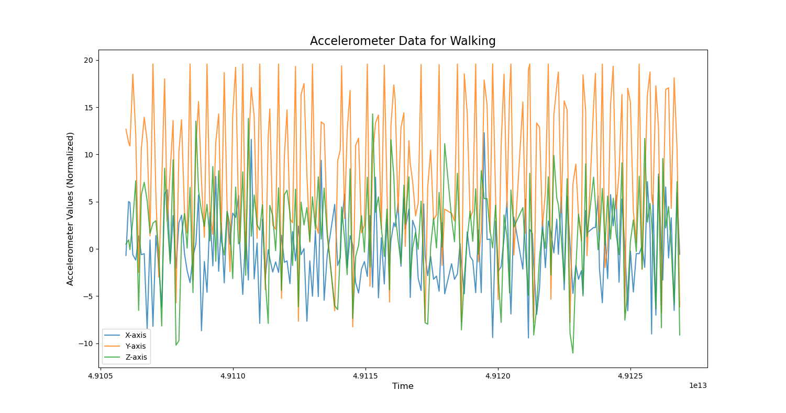
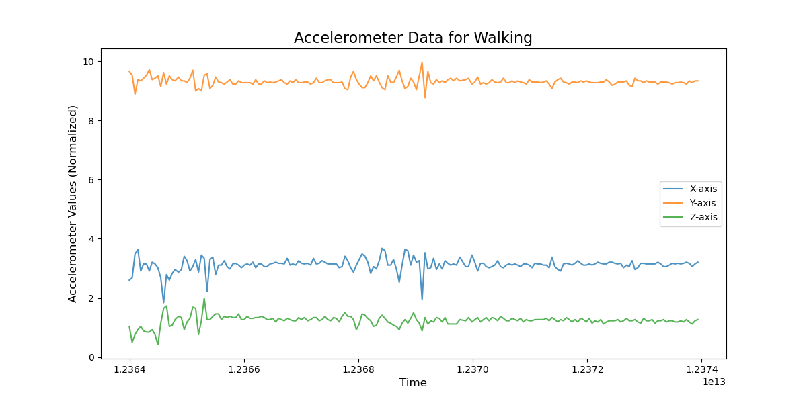
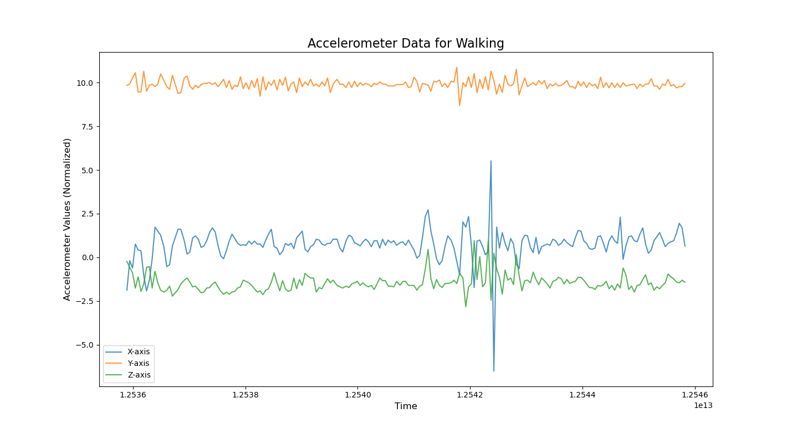
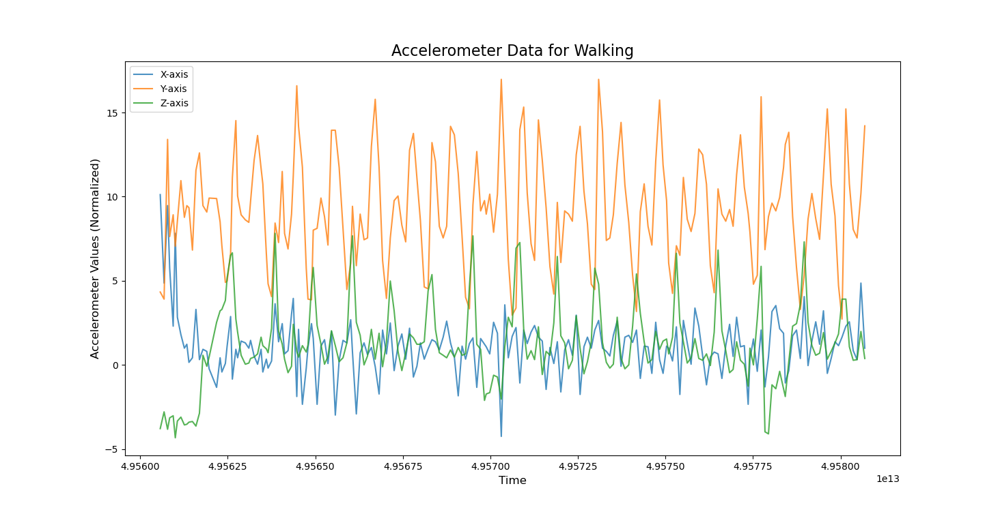

# **Human Activity Recognition Using WISDM Dataset**

This project focuses on Human Activity Recognition (HAR) using accelerometer data from the **WISDM** dataset. The primary goal is to investigate the impact of **window size** and **SMOTE balancing** on the performance of machine learning models, specifically **Random Forest** and a deep learning **LSTM-CNN hybrid model**.

---

## **Project Overview**
- **Dataset**: WISDM dataset containing labeled accelerometer data.
- **Activities**: Walking, Jogging, Upstairs, Downstairs, Sitting, and Standing.
- **Models Used**:
   - **Random Forest** (Traditional Machine Learning)
   - **LSTM-CNN Hybrid Model** (Deep Learning)

The project explores various **window sizes** (3s, 5s, 10s) to segment the time-series data and applies **SMOTE** to address the class imbalance. 

---

## **Methodology**
1. **Data Preprocessing**:
   - Segmented accelerometer data into fixed time windows with overlap.
   - Applied **Z-score normalization**.
   - Encoded activity labels into numerical values.

2. **Class Imbalance Handling**:
   - **SMOTE** (Synthetic Minority Oversampling Technique) was applied to balance the underrepresented classes.

3. **Model Training**:
   - **Random Forest**: Configured with hyperparameters for optimal performance.
   - **LSTM-CNN Hybrid**: Integrated **Conv1D** layers for spatial feature extraction and **LSTM** for temporal modeling.

---

## **Key Results**

### **1. Activity Distribution**
The WISDM dataset contains an imbalanced distribution of activity samples:



---

### **2. Model Performance**

#### **Window Size: 3 Seconds**
- **Random Forest**:
   - **Validation Accuracy**: 91%
   - **Test Accuracy**: 91%
   - **Confusion Matrix**:
     

- **LSTM-CNN Hybrid**:
   - **Test Accuracy**: **99%** (After SMOTE)
   - **Training and Validation Accuracy**:
     
   - **Confusion Matrix**:
     

#### **Window Size: 5 Seconds**
- **Random Forest**:
   - **Validation Accuracy**: 86%
   - **Test Accuracy**: 86%

- **LSTM-CNN Hybrid**:
   - Test Accuracy: 94%

#### **Window Size: 10 Seconds**
- **Random Forest**:
   - **Validation Accuracy**: 83%
   - **Test Accuracy**: 82%

- **LSTM-CNN Hybrid**:
   - Test Accuracy: 76%

---

## **Visualizations**

### **1. Accelerometer Correlation Heatmap**
The axes of the accelerometer (X, Y, Z) show minimal correlation:



### **2. Sample Accelerometer Data for Walking**
**Walking** accelerometer patterns:



### **3. Activity-Specific Accelerometer Data**
- **Jogging**:
  
- **Sitting**:
  
- **Standing**:
  
- **Upstairs**:
  

---

## **Conclusion**
- The **3-second window size** provided the best results for both **Random Forest** and **LSTM-CNN** models.
- **LSTM-CNN**, combined with **SMOTE**, outperformed the Random Forest model, achieving **99% accuracy** on the test set.
- Proper handling of class imbalance significantly improves classification performance.

---

## **How to Run the Code**
1. Clone the repository:
   ```bash
   git clone https://github.com/tgrhn/wisdm-dataset-paper.git
   cd wisdm-dataset-paper
